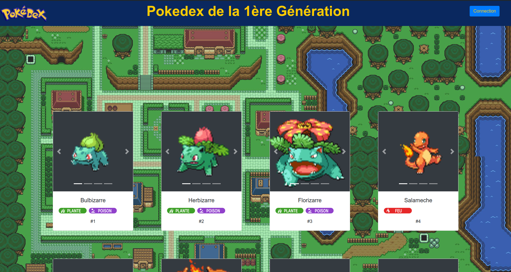
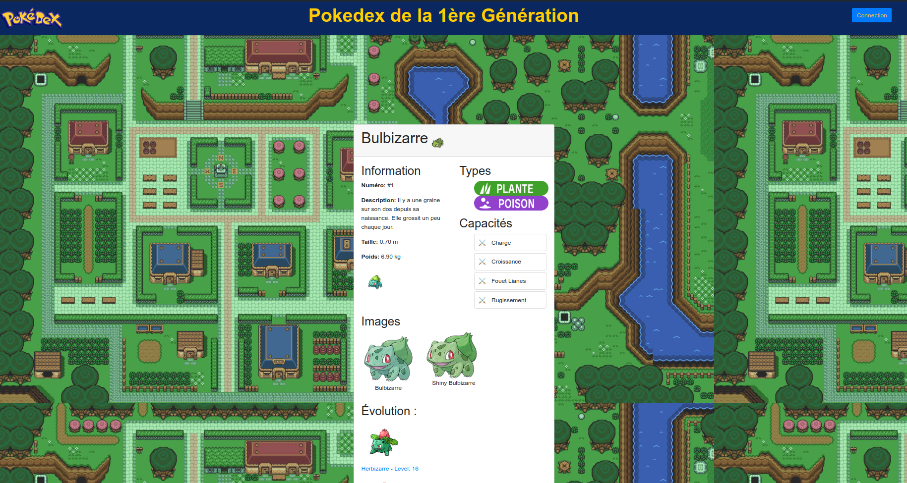
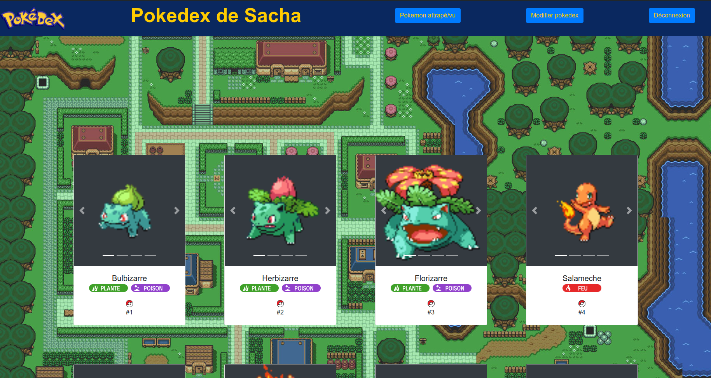
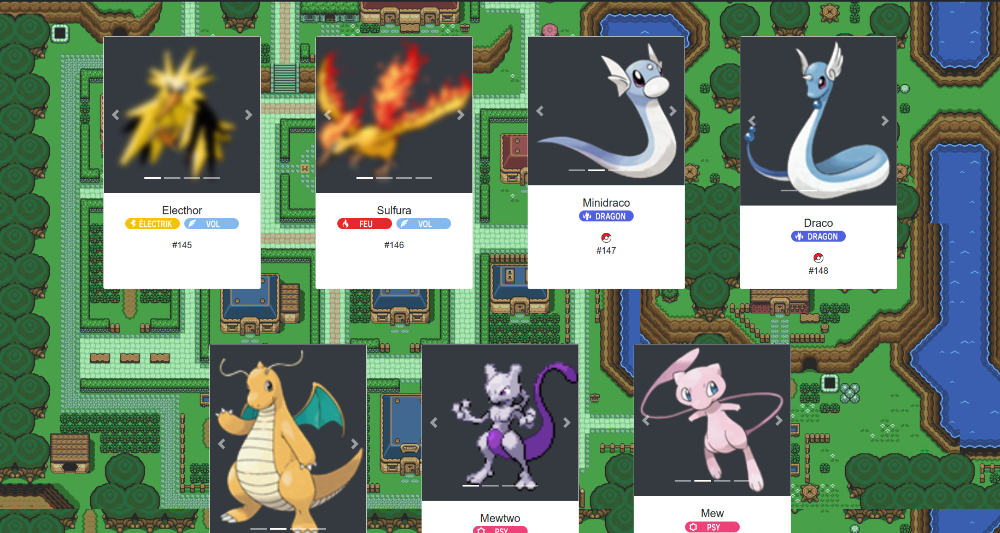
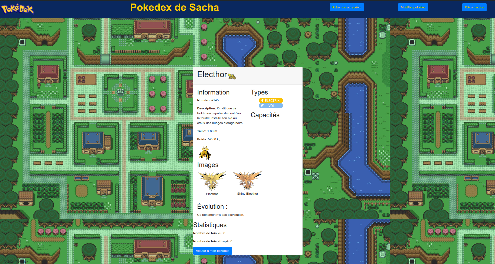
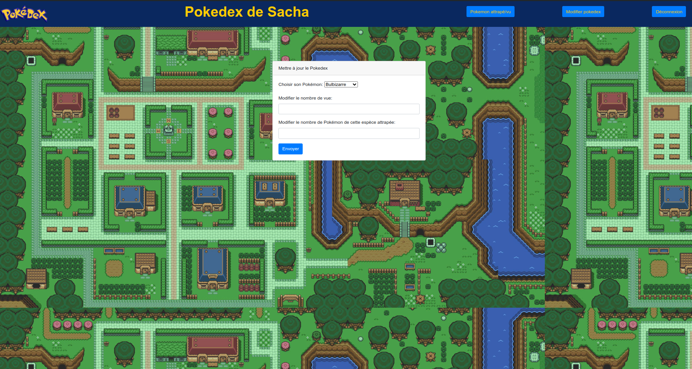
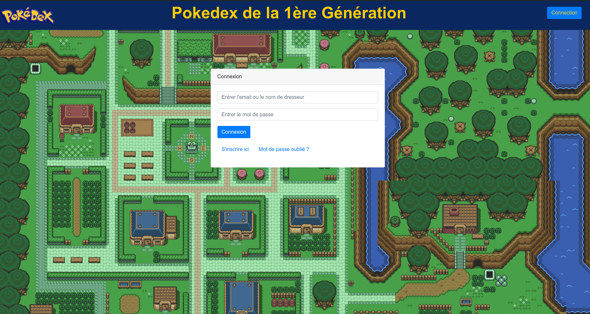
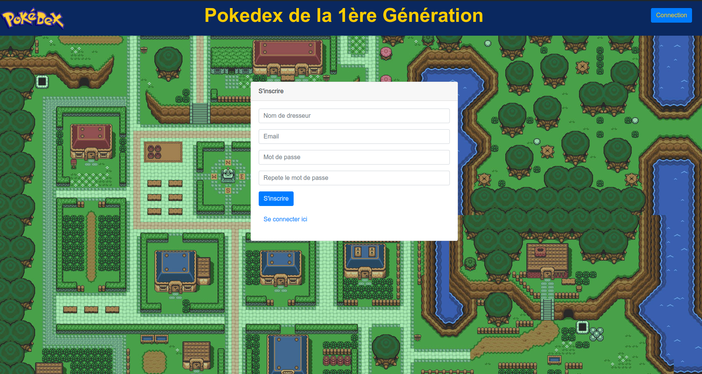

--------------------------------------------------------------------------------------------------------------[FR]---------------------------------------------------------------------------------------------------------------------------

# Pokedex

Ce projet est un Pokedex développé en PHP. Il permet aux utilisateurs de rechercher des informations sur différents Pokémon de la première génération, y compris leurs types et leurs capacités (uniquement les 18 premiers pokémons de la liste). Les utilisateurs connectés peuvent confectionner leur propre Pokedex. Ce projet suit un TP de BDD-IHM avec une base de données imposée, ce qui explique le manque d'informations.

## Fonctionnalités

- Affichage des Pokémon de la première génération
- Affichage des détails d'un Pokémon spécifique
- Affichage des types et des capacités d'un Pokémon
- Affichage des Pokémon attrapés/vus par le dresseur (utilisateur)
- Interface utilisateur simple

## Prérequis

- [XAMPP](https://www.apachefriends.org/index.html) doit être installé.
- Ou tout autre type de base de données.

## Installation

1. Clonez ce dépôt dans le répertoire de votre serveur web : `https://github.com/FlorianCliquet/Pokedex`.
2. Assurez-vous que XAMPP est démarré. Vous pouvez démarrer Apache et MySQL en exécutant `/opt/lampp/lampp start` dans votre terminal.
3. Ouvrez votre navigateur web et accédez à l'URL `http://localhost/pokedex` pour accéder au Pokedex.

## Utilisation - Non connecté

- Index.php : Affichage de tous les Pokémon de la base de données (1ère génération).
  

- Pokemon.php : Si l'on clique sur une image d'un Pokémon d'Index.php, nous pouvons avoir accès à ses caractéristiques.
  

## Utilisation - Connecté

- Index.php : Affichage de tous les Pokémon de la base de données (1ère génération). Le header change en "Pokedex de [nom_dresseur]" et on peut voir si le Pokémon est attrapé (pokeball rouge) / vu (pokeball noir et blanche) / non vu (image opaque) par le dresseur.
  
  

- Pokemon.php : Si l'on clique sur une image d'un Pokémon d'Index.php, nous pouvons toujours avoir accès à ses caractéristiques, mais aussi aux statistiques liées au Pokedex du dresseur, nombre de fois que l'on l'a vu / attrapé, et s'il n'est pas vu, nous pouvons l'ajouter directement à notre Pokedex.
  

- Pokedex.php : On peut aussi changer les valeurs liées à un Pokémon dans pokedex.php.
  

## Login-Register

- Login.php : On peut se connecter grâce à l'email renseigné ou le nom de dresseur.
  

- Register.php : Pour s'inscrire, il faut donner l'email / nom de dresseur / mot de passe. Le mot de passe est hashé quand il est conservé dans la base de données pour sécuriser le mot de passe de l'utilisateur.
  

- forgot-password.php : Si jamais l'utilisateur a oublié son mot de passe, il peut le réinitialiser grâce à un email envoyé par le serveur SMTP Gmail.
  

## Contribuer

Les contributions sont les bienvenues ! Si vous souhaitez améliorer ce projet, veuillez suivre les étapes suivantes :

1. Forkez ce dépôt.
2. Créez une branche pour vos fonctionnalités : `git checkout -b feature/NouvelleFonctionnalite`.
3. Commitez vos changements : `git commit -am 'Ajouter une nouvelle fonctionnalité'`.
4. Poussez la branche : `git push origin feature/NouvelleFonctionnalite`.
5. Créez une Pull Request.

## Auteur

Ce projet a été développé par [Florian Cliquet].

## Licence

Ce projet est sous licence MIT. Consultez le fichier LICENSE.md pour plus de détails.

--------------------------------------------------------------------------------------------------------------[EN]---------------------------------------------------------------------------------------------------------------------------

# Pokedex

This project is a Pokedex developed in PHP. It allows users to search for information about different Pokémon from the first generation, including their types and abilities (only the first 18 pokémons in the list). Logged-in users can create their own Pokedex. This project follows a BDD-IHM practical work with an imposed database, which explains the lack of information.

## Features

- Display of Pokémon from the first generation
- Display details of a specific Pokémon
- Display types and abilities of a Pokémon
- Display of Pokémon caught/seen by the trainer (user)
- Simple user interface

## Prerequisites

- [XAMPP](https://www.apachefriends.org/index.html) must be installed.
- Or any other type of database.

## Installation

1. Clone this repository into your web server directory: `https://github.com/FlorianCliquet/Pokedex`.
2. Ensure that XAMPP is started. You can start Apache and MySQL by running `/opt/lampp/lampp start` in your terminal.
3. Open your web browser and go to the URL `http://localhost/pokedex` to access the Pokedex.

## Usage - Not connected

- Index.php: Display of all Pokémon from the database (1st generation).
  

- Pokemon.php: If you click on an image of a Pokémon from Index.php, you can access its characteristics.
  

## Usage - Connected

- Index.php: Display of all Pokémon from the database (1st generation). The header changes to "Pokedex of [trainer_name]" and you can see if the Pokémon is caught (red pokeball) / seen (black and white pokeball) / unseen (opaque image) by the trainer.
  
  

- Pokemon.php: If you click on an image of a Pokémon from Index.php, you can still access its characteristics, but also the statistics related to the trainer's Pokedex, the number of times it has been seen / caught, and if it is unseen, you can add it directly to your Pokedex.
  

- Pokedex.php: You can also change the values related to a Pokémon in pokedex.php.
  

## Login-Register

- Login.php: You can log in using the provided email or trainer name.
  

- Register.php: To register, you need to provide email / trainer name / password. The password is hashed when stored in the database to secure the user's password.
  

- forgot-password.php: If the user has forgotten their password, they can reset it using an email sent by the Gmail SMTP server.
  

## Contributing

Contributions are welcome! If you'd like to improve this project, please follow these steps:

1. Fork this repository.
2. Create a branch for your features: `git checkout -b feature/NewFeature`.
3. Commit your changes: `git commit -am 'Add a new feature'`.
4. Push the branch: `git push origin feature/NewFeature`.
5. Create a Pull Request.

## Author

This project was developed by [Florian Cliquet].

## License

This project is under the MIT license. See the LICENSE.md file for more details.
